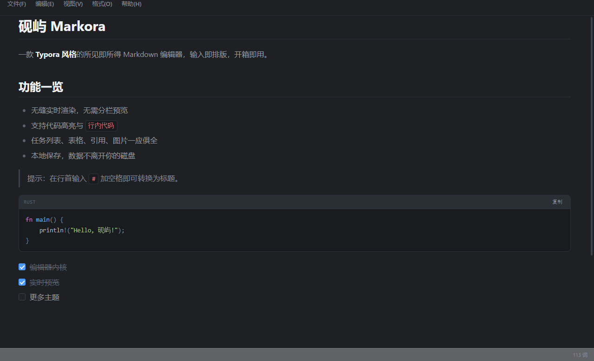

# 砚屿

砚屿是一款 Typora 风格的**所见即所得（WYSIWYG）Markdown 编辑器**，基于 Electron 构建。输入即排版，无需分栏预览；文档全部保存在本地，不联网、不上传。

[0](./LICENSE)   

## 界面预览

**浅色主题**


**深色主题**



## 功能特性

- **所见即所得编辑**：输入 `#` `>` `-` `` ``` `` 等标记即时排版，无需切换预览窗格
- **本地优先**：不联网、不上传，数据始终在你自己的磁盘上
- **工作区模式**：打开文件夹，左侧文件树直接浏览、编辑 Markdown
- **实时预览**：代码高亮、任务列表、表格、引用、图片一应俱全
- **查找替换、缩放与全屏**
- **多主题**：浅色 / 深色 / 夜间 / 纸感，标题栏配色随主题联动
- **多窗口**：`Ctrl+N` 新建独立编辑窗口，新窗口主题与主窗口一致
- **导出**：Markdown / HTML，并可通过系统打印导出 PDF
- **最近文档与最近工作区**记录

## 下载安装

前往 [Releases](https://github.com/starisledev/markdownProgram/releases/latest) 下载最新版本：

- **安装版（推荐）**：`Markora_1.2.0_x64-setup.exe`（NSIS 引导安装）或 `Markora_1.2.0_x64_en-US.msi`，双击即可安装
- **便携版**：`markora-v1.2.0-windows-x64.zip`，解压后直接运行 `markora.exe`，无需安装

> 系统要求：Windows 10/11；Electron 自带 Chromium 运行时，无需额外安装 WebView2 Runtime。

## 技术架构

- **运行时**：Electron（Chromium 渲染 UI + Node.js 主进程），一套代码多平台
- **前端**：原生 HTML / CSS / JavaScript，无任何构建步骤，无需 npm
  - `editor.js`：contenteditable 所见即所得编辑内核
  - `markdown.js`：编辑器内实时渲染
  - `to-markdown.js`：DOM 转回 Markdown 源码
  - `highlight.js`：轻量代码高亮
  - `store.js`：文档与 UI 状态（localStorage）
  - `app.js`：应用层（菜单 / 主题 / 快捷键 / 工作区 / 查找替换）
- **主进程**（`electron/`）：
  - `main.js`：窗口创建、文件系统读写、打开/另存为对话框、最近工作区、多窗口与主题联动
  - `preload.js`：以 `window.markoraBridge` 暴露统一桥接契约（通过 IPC invoke 调用主进程能力）

## 目录结构

```text
markdownProgram/
├── README.md
├── LICENSE
├── package.json              # Electron 入口与 electron-builder 打包配置
├── build/                    # 打包图标（icon.ico 等）
├── docs/
│   └── screenshots/          # README 截图
├── electron/
│   ├── main.js               # Electron 主进程（窗口 / IPC / 文件系统）
│   └── preload.js            # 桥接层（window.markoraBridge）
├── frontend/                 # 前端（纯静态资源，无需构建）
│   ├── index.html            # 页面骨架
│   ├── css/
│   │   ├── style.css         # 主样式
│   │   └── themes.css        # 主题样式
│   └── js/
│       ├── app.js            # 应用层
│       ├── editor.js         # 所见即所得编辑内核
│       ├── markdown.js       # 实时渲染
│       ├── to-markdown.js    # 导出 Markdown
│       ├── highlight.js      # 代码高亮
│       └── store.js          # 数据层
├── tools/
│   └── make_icon.py          # 图标生成脚本
└── dist/                     # 发布脚本与发布说明（zip 不入库）
```

## 从源码编译（Windows）

### 环境要求

**Node.js 18+（含 npm）**：<https://nodejs.org/>

### 编译步骤

克隆仓库并安装依赖：

```powershell
git clone https://github.com/starisledev/markdownProgram.git
cd markdownProgram
npm install
```

**开发调试**（启动开发窗口）：

```powershell
npm start
```

**发布构建**（生成 NSIS 安装程序 + 便携 zip）：

```powershell
npm run dist
```

产物位于：

```text
dist-electron/
├── Markora-1.3.0-windows-x64-setup.exe   # NSIS 安装程序（双击安装）
└── Markora-1.3.0-windows-x64.zip         # 便携版（解压即用）
```

### 前端说明

前端（`frontend/`）为纯静态资源，**无需任何构建步骤**；Electron 通过 `preload.js` 向页面注入 `window.markoraBridge`，把主进程的文件系统、对话框、窗口能力以 IPC 形式暴露给前端，页面逻辑与浏览器预览行为保持一致。

## 使用提示

- 启动后可直接新建文档输入，`Ctrl+S` 导出 Markdown，`Ctrl+P` 打印 / 导出 PDF。
- `Ctrl+N` 新建独立编辑窗口；`Ctrl+O` 打开 Markdown 文件。
- 通过菜单「文件 → 打开文件夹…」进入工作区模式，左侧文件树可管理整个目录的 Markdown。
- 右下角状态栏可切换主题（浅色 / 深色 / 夜间 / 纸感）与缩放。

## 隐私说明

砚屿**不收集任何数据**：无遥测、无账号体系、无网络请求。所有文档与配置均保存在本地磁盘。

## 开源许可

本项目采用自定义非商业许可证（[LICENSE](./LICENSE)）发布：

- ✅ 个人学习、研究、使用
- ✅ 修改与非商业性质的分发（需保留版权与许可声明）
- ❌ **任何形式的商业使用与商业性二次开发**（包括但不限于出售、付费下载、商业产品内置、闭源商业化）
- ❌ 移除或遮挡版权与许可声明

衍生作品必须同样以本许可发布并保持开源。如需商业授权，请通过 [Issues](https://github.com/starisledev/markdownProgram/issues) 联系作者。
